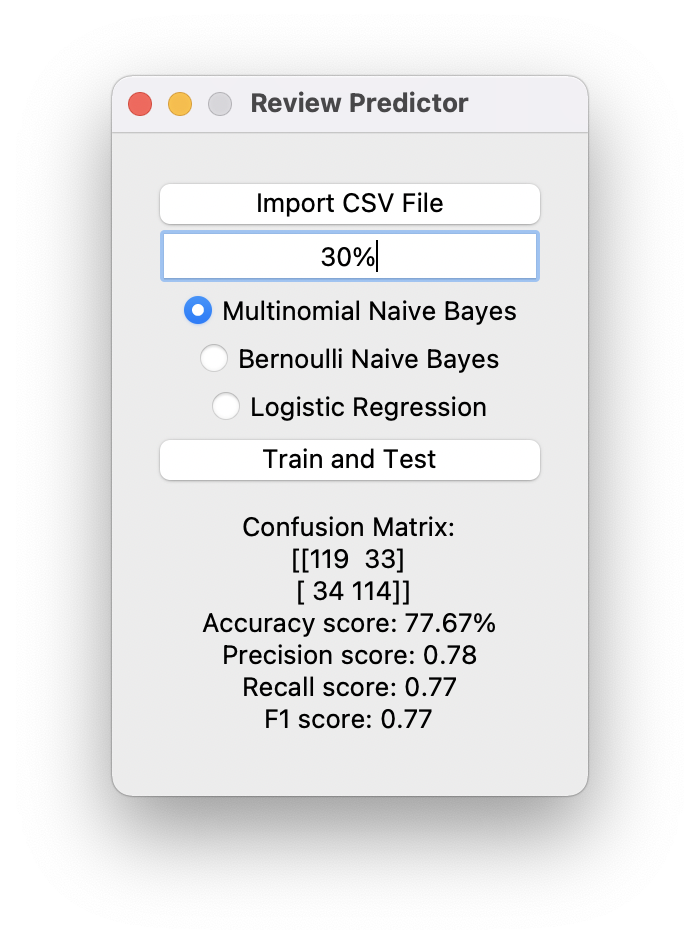

# Restaurant Reviews - UAS

## Introduction
The purpose of this project is to build a prediction model to predict whether a review on a restaurant is positive or negative. To do so, we will work on Restaurant Review dataset, we will load it into predicitve algorithms Multinomial Naive Bayes, Bernoulli Naive Bayes and Logistic Regression.

## Explanation
To build a model to predict whether a review is positive or negative, following steps are performed.
- Importing Dataset
- Preprocessing Dataset
- Vectorization
- Training and Classification
- Analysis Conclusion

## How to Use
- Import a CSV file
- Enter test size in percent (e.g. 30 or 30%)
- Choose an algorithm to train and test the dataset
- Click Train and Test

## Dataset
Thanks to [Harshit Joshi on Kaggle](https://www.kaggle.com/hj5992/restaurantreviews)

## Requirements
- Check [requirements.txt](https://github.com/jacenyang/restaurant-reviews-uas/blob/master/requirements.txt) and make sure those packages are installed. You can install the packages by running this command line.
```sh
pip freeze > requirements.txt 
```
- Download stopwords from ntlk by running this script.
```sh
import nltk
nltk.download('stopwords')
```

## Algorithms
This is the result using 30% test size.
- Multinomial Naive Bayes
```sh
Confusion matrix:
[[119  33]
 [ 34 114]]
Accuracy score: 77.67%
Precision score: 0.78
Recall score: 0.77
F1 score: 0.77
```
- Bernoulli Naive Bayes
```sh
Confusion matrix:
[[115  37]
 [ 32 116]]
Accuracy score: 77.0%
Precision score: 0.76
Recall score: 0.78
F1 score: 0.77
```
- Logistic Regression
```sh
Confusion matrix:
[[125  27]
 [ 43 105]]
Accuracy score: 76.67%
Precision score: 0.8
Recall score: 0.71
F1 score: 0.75
```

## Screenshot

